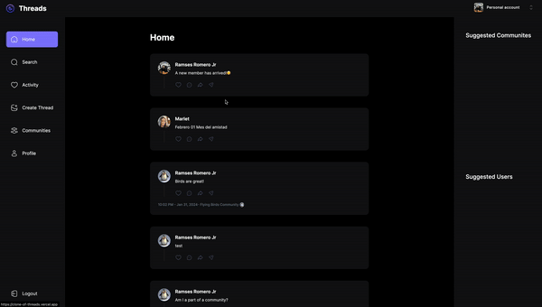

<!-- PROJECT SHIELDS -->
<!--
*** I'm using markdown "reference style" links for readability.
*** Reference links are enclosed in brackets [ ] instead of parentheses ( ).
*** See the bottom of this document for the declaration of the reference variables
*** for contributors-url, forks-url, etc. This is an optional, concise syntax you may use.
*** https://www.markdownguide.org/basic-syntax/#reference-style-links
-->

[![LinkedIn][linkedin-shield]][linkedin-url]

<!-- PROJECT LOGO -->
 

  

  <h3 align="center">Threads Clone</h3>

  

    A threads clone... with extra features
     
     
    <a href="https://clone-of-threads.vercel.app/">View Live</a>
    ·
    <a href="https://github.com/RamsesRomeroJr/Threads/issues">Report Bug</a>
    ·
    <a href="https://github.com/RamsesRomeroJr/Threads/issues">Request Feature</a>
  

<!-- TABLE OF CONTENTS -->

  
Table of Contents

  <ol>
    <li>
      <a href="#about-the-project">About The Project</a>
      <ul>
        <li><a href="#built-with">Built With</a></li>
      </ul>
    </li>
    <li><a href="#usage">Usage</a></li>
    <li><a href="#roadmap">Roadmap</a></li>
    <li><a href="#contact">Contact</a></li>
  </ol>

<!-- ABOUT THE PROJECT -->
## About The Project

Threads Inspired Website.

(<a href="#readme-top">back to top</a>)

### Built With

This section list major frameworks/libraries used to build this project.

* [![Typescript][Typescript]][Typescript-url]
* [![React][React.js]][React-url]
* [![Next][Next.js]][Next-url]
* [![Mongoose][Mongoose]][Mongoose-url]
* [![Clerk][Clerk]][Clerk-url]
* [![Tailwind][Tailwind]][Tailwind-url]

(<a href="#readme-top">back to top</a>)

<!-- USAGE EXAMPLES -->
## Usage

### Some of the features that you can use with this website
- Being able to sign-up/login

- Onboarding

- Create Thread Post

- Reply To Threads

- See Users Profiles

- View Communites

- View Recent Activity

(<a href="#readme-top">back to top</a>)

<!-- ROADMAP -->
## Roadmap

### Completed
- [x] User Authentication with Clerk
- [x] User Onboarding after sign up
- [x] Database for recorded threads/communities
- [x] Create Thread Functionality
- [x] Reply Functionality
- [x] Users Profile Info page
- [x] Community Info Page
- [x] Activity Page
- [x] Added Post date to all threads

### To Do
- [ ] Share Functionality
- [ ] Comments On Thread that shows commenters profile image
- [ ] Suggested Communities
- [ ] Suggested Users
- [ ] Like Functionality
- [ ] Search Bar Functionality
- [ ] Repost Functionality

See the [open issues](https://github.com/RamsesRomeroJr/Threads/issues) for a full list of proposed features (and known issues).

(<a href="#readme-top">back to top</a>)

<!-- CONTACT -->
## Contact

Ramses Romero JR - [LinkedIn](https://www.linkedin.com/in/ramses-romero-jr/) - ramses.romero.jr@gmail.com

Project Link: [https://github.com/RamsesRomeroJr/Threads](https://github.com/RamsesRomeroJr/Threads)

(<a href="#readme-top">back to top</a>)

<!-- MARKDOWN LINKS & IMAGES -->
<!-- https://www.markdownguide.org/basic-syntax/#reference-style-links -->
[Clerk]: https://img.shields.io/badge/Clerk-000000?style=for-the-badge&logo=clerk&logoColor=b0a5f5
[Clerk-url]: https://clerk.com/
[linkedin-shield]: https://img.shields.io/badge/-LinkedIn-black.svg?style=for-the-badge&logo=linkedin&colorB=555
[linkedin-url]: https://www.linkedin.com/in/ramses-romero-jr/
[Mongoose]: https://img.shields.io/badge/Mongoose-000000?style=for-the-badge&logo=mongoose&logoColor=red
[Mongoose-url]: https://www.mongodb.com/developer/languages/javascript/getting-started-with-mongodb-and-mongoose/
[Next.js]: https://img.shields.io/badge/next.js-000000?style=for-the-badge&logo=nextdotjs&logoColor=white
[Next-url]: https://nextjs.org/
[React.js]: https://img.shields.io/badge/React-000000?style=for-the-badge&logo=react&logoColor=61DAFB
[React-url]: https://reactjs.org/
[Tailwind]: https://img.shields.io/badge/TailwindCSS-000000?style=for-the-badge&logo=tailwindcss&logoColor=#38BDF8
[Tailwind-url]: https://tailwindcss.com/
[Typescript]: https://img.shields.io/badge/Typescript-000000?style=for-the-badge&logo=typescript&logoColor=lightblue
[Typescript-url]: https://www.typescriptlang.org/
